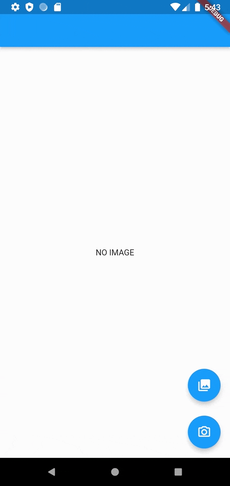
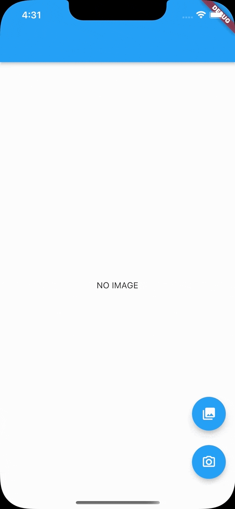

# ncnn_yolox_flutter

This is a plugin to run YOLOX on ncnn.

## Demo

### on Android

| Real Device                                        | Simulator                                                    |
| -------------------------------------------------- | ------------------------------------------------------------ |
|  |  |

### on iOS

| Real Device                                    | Simulator                                                |
| ---------------------------------------------- | -------------------------------------------------------- |
|  |  |

## How to use

### 1. Add the YOLOX model to assets

For example, you can use [yolox_onnx_to_ncnn.ipynb](notebooks/yolox_onnx_to_ncnn.ipynb)

**Note that you will need to manually modify the model.**

---

If you want to use yolox_tiny, you can find it in [example/assets/yolox](example/assets/yolox).

---

Don't forget to add the model of assets to your `pubspec.yaml`.

```pubspec.yaml
flutter:
  assets:
    - assets/yolox/
```

### 2. Load the model

```dart
final ncnn = NcnnYolox();

ncnn.initYolox(
  modelPath: 'assets/yolox/yolox.bin',
  paramPath: 'assets/yolox/yolox.param',
);
```

### 3. Get the result

Give the file path of the image to `detect` to get the result.

```dart
_results = ncnn.detect(imagePath: image.path);
```

Please check [example/lib/main.dart](example/lib/main.dart) for specific usage.

## How to set up for using custom ncnn and custom YOLOX model

### 1. Build ncnn

See [build_ncnn.yaml](.github/workflows/build_ncnn.yaml) for details.

If you want the pre-built ncnn, you can download it from Artifacts in [Actions](https://github.com/KoheiKanagu/ncnn_yolox_flutter/actions/workflows/build_ncnn.yaml).

### 2. Download ncnn

The library is a binary file, so it is not packaged in the repository.
The ncnn libraries for iOS and Android are CMake and Cocoapods, downloaded from Github Releases.

- [android/CMakeLists.txt](android/CMakeLists.txt)
- [ios/ncnn_yolox_flutter.podspec](ios/ncnn_yolox_flutter.podspec)

The ncnn library zip you are downloading is the artifact of [build_ncnn.yaml](.github/workflows/build_ncnn.yaml). Change the URL if you want.

---

If you do not want to download the ncnn library, remove the process of downloading the zip.
Then install the ncnn library manually.

Please refer to the comments in these files.

- [android/CMakeLists.txt](android/CMakeLists.txt)
- [ios/ncnn_yolox_flutter.podspec](ios/ncnn_yolox_flutter.podspec)

### 3. Change the parameters of YOLOX

Change [ios/Classes/yolox.cpp](IOS/Classes/yolox.cpp) if you want.

For example, if you want to change the size of the input image, change `YOLOX_TARGET_SIZE`.

Alternatively, you can change the `ncnn::Net yolox;` in the `void initYolox(char *modelPath, char *paramPath)` method.

---

The original `yolox.cpp` is [ncnn/yolox\.cpp at 20220216 · Tencent/ncnn](https://github.com/Tencent/ncnn/blob/20220216/examples/yolox.cpp).
