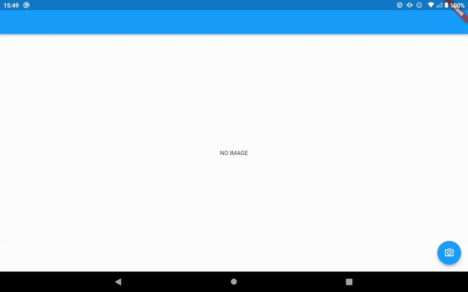

# ncnn_yolox_flutter

This is a plugin to run YOLOX on ncnn.

I have confirmed that it works on Android.

Support for iOS is TODO.

## Demo

### on Android



### on iOS

TODO

## How to use

### 1. Add the YOLOX model to assets

For example, you can use [yolox_onnx_to_ncnn.ipynb](notebooks/yolox_onnx_to_ncnn.ipynb)

**Note that you will need to manually modify the model.**

If you want to use yolox_tiny, you can find it in [example/assets/yolox](example/assets/yolox).

---

Don't forget to add the model of assets to your `pubspec.yaml`.

```pubspec.yaml
flutter:
  assets:
    - assets/yolox/
```

### 2. Load the model

```dart
final ncnn = NcnnYolox();

ncnn.initYolox(
  modelPath: 'assets/yolox/yolox.bin',
  paramPath: 'assets/yolox/yolox.param',
);
```

### 3. Get the result

Give the file path of the image to `detect` to get the result.

```dart
_results = ncnn.detect(imagePath: image.path);
```

Please check [example/lib/main.dart](example/lib/main.dart) for specific usage.

## How to set up for using custom ncnn and custom YOLOX model

### 1. Build ncnn

See [ncnn_build.ipynb](notebooks/ncnn_build.ipynb) for details.

iOS is a TODO.

### 2. Copy ncnn

Copy the artifacts to the android directory.

```sh
unzip ncnn-build-android.zip
cp -r content/ncnn/build-android-armv7/install/ /YOU/PATH/ncnn_yolox_flutter/android/ncnn-20220216/armeabi-v7a/
cp -r content/ncnn/build-android-aarch64/install/ /YOU/PATH/ncnn_yolox_flutter/android/ncnn-20220216/arm64-v8a/
```

The tree will look like this

```sh
.
├── android
│   ├── ncnn-20220216
│   │   ├── arm64-v8a
│   │   │   ├── include
│   │   │   └── lib
│   │   └── armeabi-v7a
│   │       ├── include
│   │       └── lib
```

Change `ncnn_DIR` in [android/CMakeLists.txt](android/CMakeLists.txt) if you want.

### 3. Change the parameters of YOLOX

Change [ios/Classes/yolox.cpp](ios/Classes/yolox.cpp) if necessary.

For example, if you want to change the size of the input image, change `YOLOX_TARGET_SIZE`.

Alternatively, you can change the `ncnn::Net yolox;` in the `void initYolox(char *modelPath, char *paramPath)` method.

---

The original `yolox.cpp` is [ncnn/yolox\.cpp at 20220216 · Tencent/ncnn](https://github.com/Tencent/ncnn/blob/20220216/examples/yolox.cpp).
